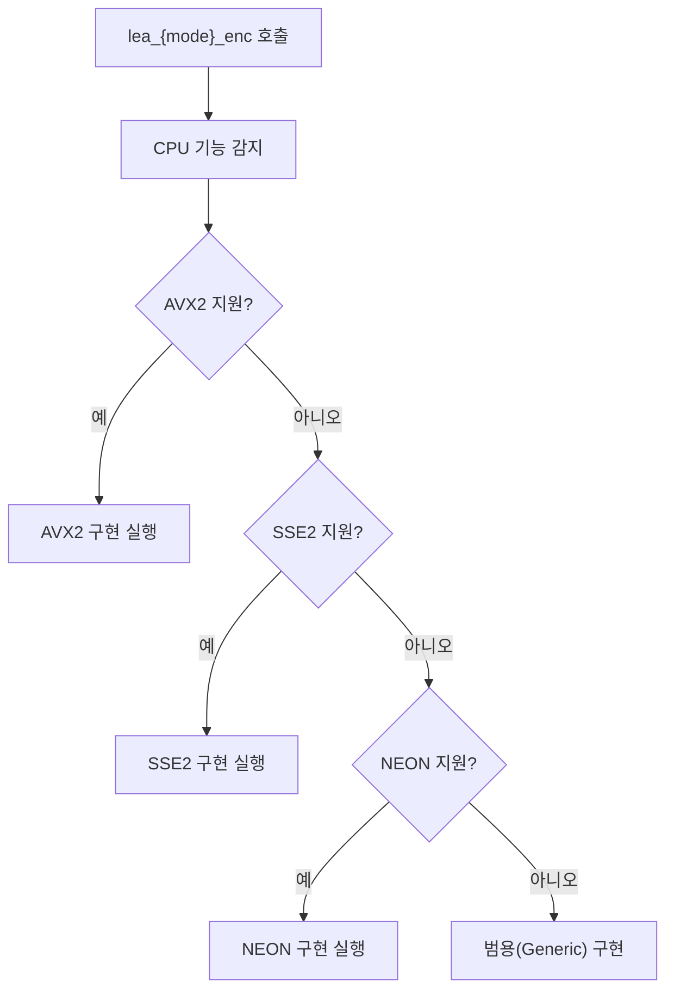
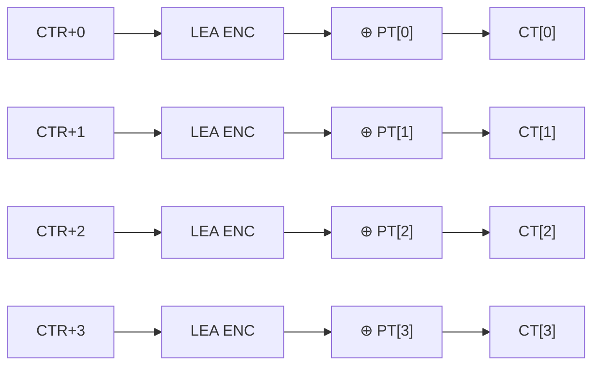

# [OPT.001] SIMD 가속 구현

## 1. 보안요구사항 개요
LEA는 SSE2, AVX2, XOP(x86), NEON(ARM) 등 SIMD(Single Instruction Multiple Data) 명령어를 활용하여 ECB, CTR, CCM, GCM 암복호화 및 CBC 복호화를 병렬 처리할 수 있으며, PCLMULQDQ 명령어를 통해 GCM 인증값 생성(GHASH)을 하드웨어 가속할 수 있다. SIMD 적용 시 동일한 암호학적 결과를 보장하면서 처리 성능을 향상시킨다.

## 2. 상세 요구사항 (Requirements)
- **LEA-042**: SIMD 확장 명령어를 활용한 LEA 구현은 범용 구현과 동일한 암호학적 결과를 생성해야 하며, 런타임에 CPU 지원 여부를 확인하여 적절한 구현을 선택해야 한다.
- **CTR-LEA-005**: CTR 모드에서 SIMD를 활용한 카운터 블록 병렬 암호화를 지원하여 높은 처리 성능을 달성해야 한다.

### 2.1. SIMD 기술별 적용 범위

| SIMD 기술 | 플랫폼 | 적용 운영모드 |
| :--- | :--- | :--- |
| SSE2 | x86/x64 | ECB, CTR, CCM, GCM enc/dec, CBC dec |
| AVX2 | x86/x64 | ECB, CTR, CCM, GCM enc/dec, CBC dec |
| XOP | AMD x86/x64 | ECB, CTR, CCM, GCM enc/dec, CBC dec |
| NEON | ARM | ECB, CTR, CCM, GCM enc/dec, CBC dec |
| PCLMULQDQ | x86/x64 | GCM 인증값 생성 (GHASH) |

### 2.2. 컴파일 옵션

| SIMD 기술 | 컴파일러 옵션 (gcc) |
| :--- | :--- |
| SSE2 | `-msse2` |
| AVX2 | `-mavx2` |
| XOP | `-mxop` |
| NEON (ARM) | `-mfloat-abi=softfp -mfpu=neon` |
| PCLMULQDQ | `-mpclmul` |

## 3. 작성 예시 (Examples)
### 3.1. 런타임 SIMD 감지 (C 의사코드)

```c
#include "cpu_info.h"

void lea_ecb_enc(unsigned char *ct, const unsigned char *pt,
                 unsigned int pt_len, const LEA_KEY *key) {
    if (cpu_supports_avx2()) {
        lea_ecb_enc_avx2(ct, pt, pt_len, key);
    } else if (cpu_supports_sse2()) {
        lea_ecb_enc_sse2(ct, pt, pt_len, key);
    } else {
        lea_ecb_enc_generic(ct, pt, pt_len, key);
    }
}
```

### 3.2. SIMD 병렬 처리 개념 (CTR 모드)

```c
/* CTR 모드 — 4블록 병렬 암호화 (SSE2) */
__m128i ctr0 = _mm_loadu_si128((__m128i*)counter);
__m128i ctr1 = increment_counter(ctr0);
__m128i ctr2 = increment_counter(ctr1);
__m128i ctr3 = increment_counter(ctr2);

/* 4개의 카운터 블록을 동시에 LEA 암호화 */
lea_encrypt_4blocks_sse2(enc_out, ctr0, ctr1, ctr2, ctr3, key);

/* 평문과 XOR */
for (int i = 0; i < 4; i++) {
    _mm_storeu_si128((__m128i*)(ct + i*16),
        _mm_xor_si128(enc_out[i],
            _mm_loadu_si128((__m128i*)(pt + i*16))));
}
```

### 3.3. 서술형 예시
"본 구현은 런타임에 CPU의 SIMD 지원 여부를 확인하고, AVX2 > SSE2 > Generic 순으로 최적화된 구현을 자동 선택한다. CTR 모드에서는 SSE2/AVX2를 활용하여 4~8블록을 동시 암호화하여 처리량을 향상시킨다. SIMD 구현은 범용 구현과 동일한 KAT(Known Answer Test) 결과를 생성한다."

## 4. 구조도 및 시각 자료 (Visuals)
### 4.1. SIMD 디스패치 흐름 (Mermaid)



### 4.2. CTR 모드 병렬 처리 구조



### 4.3. 구조 설명
- SIMD 디스패치는 프로그램 시작 시 또는 첫 호출 시 CPU 기능을 감지하여 함수 포인터를 설정한다.
- CTR 모드는 카운터 블록이 독립적이므로 SIMD를 통한 4~8블록 동시 암호화가 가능하다.

## 5. 해설 및 증빙 가이드 (Guide)
- **결과 동일성 보장**: SIMD 구현은 반드시 범용(Generic) 구현과 동일한 암호문을 생성해야 한다. KAT 테스트로 검증한다.
- **CBC 암호화 제외**: CBC 암호화는 이전 블록에 의존하므로 SIMD 병렬 처리가 불가능하다. CBC 복호화만 병렬 처리가 가능하다.
- **폴백(Fallback) 필수**: SIMD를 지원하지 않는 CPU에서도 동작해야 하므로 범용 구현(`lea_t_generic.c`)은 반드시 포함되어야 한다.
- **증빙 시 주안점**: SIMD 구현 파일이 존재하고 컴파일 옵션이 올바른지, 런타임 디스패치 로직이 구현되어 있는지, 범용 폴백이 존재하는지 확인한다.
- **참고 규격**: LEA 논문 §5.1.
