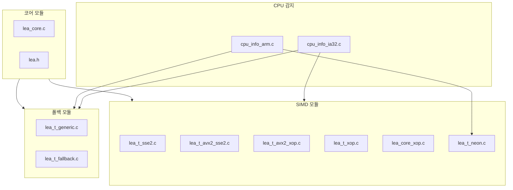

# [OPT.002] 확장 모듈 참조

## 1. 보안요구사항 개요
LEA 소스코드는 SIMD 기술별로 독립된 소스 파일로 모듈화되어 있으며, `cpu_info_ia32.c`(x86)와 `cpu_info_arm.c`(ARM)를 통해 런타임에 CPU의 SIMD 지원 여부를 확인하여 최적의 구현을 자동 선택한다.

## 2. 상세 요구사항 (Requirements)
- **LEA-042**: SIMD 확장 모듈은 기술별로 독립 파일로 구성하여 빌드 시스템에서 선택적으로 컴파일할 수 있어야 하며, 런타임 CPU 정보 확인을 통해 적절한 모듈을 디스패치해야 한다.

### 2.1. SIMD별 소스 파일 구성

| 파일명 | SIMD 기술 | 설명 |
| :--- | :--- | :--- |
| `lea_t_sse2.c` | SSE2 | x86 SSE2 최적화 구현 |
| `lea_t_xop.c` | XOP | AMD XOP 최적화 구현 |
| `lea_t_avx2_sse2.c` | AVX2 + SSE2 | AVX2 기반, SSE2 폴백 포함 |
| `lea_t_avx2_xop.c` | AVX2 + XOP | AVX2 기반, XOP 활용 |
| `lea_t_neon.c` | NEON | ARM NEON 최적화 구현 |
| `lea_core_xop.c` | XOP | XOP 기본 함수 (코어 연산) |
| `lea_t_generic.c` | 없음 (범용) | SIMD 없는 기본 구현 |
| `lea_t_fallback.c` | 없음 (대체) | 대체(폴백) 구현 |

### 2.2. CPU 정보 감지 모듈

| 파일명 | 플랫폼 | 역할 |
| :--- | :--- | :--- |
| `cpu_info_ia32.c` | x86/x64 | CPUID로 SSE2, AVX2, XOP, PCLMULQDQ 지원 확인 |
| `cpu_info_arm.c` | ARM | NEON 지원 여부 확인 |

## 3. 작성 예시 (Examples)
### 3.1. CPU 정보 감지 코드 (C 의사코드)

```c
/* cpu_info_ia32.c */
#include <cpuid.h>

typedef struct {
    int has_sse2;
    int has_avx2;
    int has_xop;
    int has_pclmulqdq;
} cpu_features_t;

void detect_cpu_features(cpu_features_t *feat) {
    unsigned int eax, ebx, ecx, edx;

    __cpuid(1, eax, ebx, ecx, edx);
    feat->has_sse2 = (edx >> 26) & 1;
    feat->has_pclmulqdq = (ecx >> 1) & 1;

    __cpuid_count(7, 0, eax, ebx, ecx, edx);
    feat->has_avx2 = (ebx >> 5) & 1;

    __cpuid(0x80000001, eax, ebx, ecx, edx);
    feat->has_xop = (ecx >> 11) & 1;
}
```

### 3.2. 빌드 시스템 구성 예시 (Makefile)

```makefile
# SIMD 모듈별 컴파일 옵션
lea_t_sse2.o: lea_t_sse2.c
	$(CC) $(CFLAGS) -msse2 -c $< -o $@

lea_t_avx2_sse2.o: lea_t_avx2_sse2.c
	$(CC) $(CFLAGS) -mavx2 -msse2 -c $< -o $@

lea_t_xop.o: lea_t_xop.c
	$(CC) $(CFLAGS) -mxop -c $< -o $@

lea_t_neon.o: lea_t_neon.c
	$(CC) $(CFLAGS) -mfloat-abi=softfp -mfpu=neon -c $< -o $@

lea_t_generic.o: lea_t_generic.c
	$(CC) $(CFLAGS) -c $< -o $@
```

### 3.3. 표 형식 정리 — 파일 의존성

| SIMD 구현 파일 | 컴파일 옵션 | CPU 요구사항 |
| :--- | :--- | :--- |
| `lea_t_sse2.c` | `-msse2` | SSE2 |
| `lea_t_avx2_sse2.c` | `-mavx2 -msse2` | AVX2, SSE2 |
| `lea_t_avx2_xop.c` | `-mavx2 -mxop` | AVX2, XOP |
| `lea_t_xop.c` | `-mxop` | XOP |
| `lea_t_neon.c` | `-mfloat-abi=softfp -mfpu=neon` | NEON |
| `lea_t_generic.c` | (없음) | (없음) |
| `lea_t_fallback.c` | (없음) | (없음) |

### 3.4. 서술형 예시
"본 구현은 SIMD 기술별로 독립된 소스 파일(`lea_t_sse2.c`, `lea_t_avx2_sse2.c`, `lea_t_neon.c` 등)로 모듈화되어 있으며, `cpu_info_ia32.c`에서 CPUID 명령어를 통해 런타임에 CPU 기능을 감지하여 최적의 SIMD 구현을 자동 선택한다. SIMD를 지원하지 않는 환경에서는 `lea_t_generic.c`가 사용된다."

## 4. 구조도 및 시각 자료 (Visuals)
### 4.1. 소스 파일 모듈 구조 (Mermaid)



### 4.2. 구조 설명
- 각 SIMD 모듈은 독립적으로 컴파일되므로 특정 SIMD 기술을 지원하지 않는 컴파일러에서도 나머지 모듈을 빌드할 수 있다.
- CPU 감지 모듈은 프로그램 초기화 시 한 번만 실행되며, 결과를 전역 변수에 캐싱한다.

## 5. 해설 및 증빙 가이드 (Guide)
- **모듈 독립성**: 각 SIMD 파일은 독립적으로 컴파일·링크 가능해야 하며, 다른 SIMD 모듈에 의존하지 않아야 한다.
- **범용 구현 필수**: `lea_t_generic.c` 또는 `lea_t_fallback.c`는 SIMD를 지원하지 않는 모든 환경에서 동작 보장을 위해 반드시 포함되어야 한다.
- **CPUID 정확성**: `cpu_info_ia32.c`에서 CPUID 비트 위치가 올바르게 설정되어 있는지 확인한다. 잘못된 감지는 SIMD 미지원 CPU에서 크래시를 유발할 수 있다.
- **증빙 시 주안점**: 위 표의 파일들이 소스 트리에 존재하는지, 각 파일이 해당 SIMD 기술에 맞는 컴파일 옵션으로 빌드되는지, CPU 감지 로직이 올바른지 확인한다.
- **참고 규격**: 블록암호 LEA 소스코드 사용 매뉴얼(v1.0) §3.
