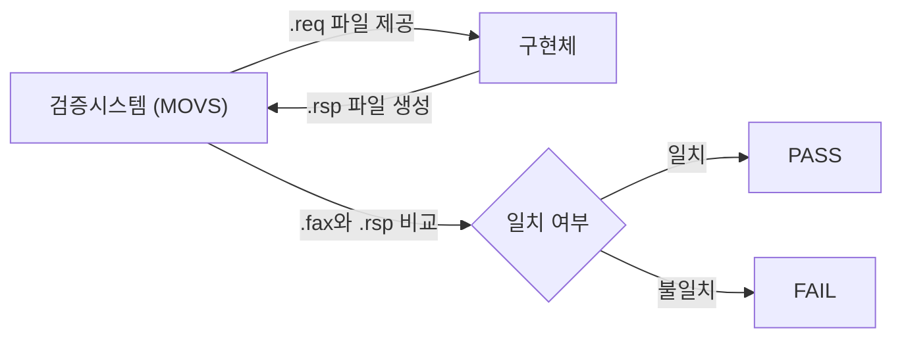
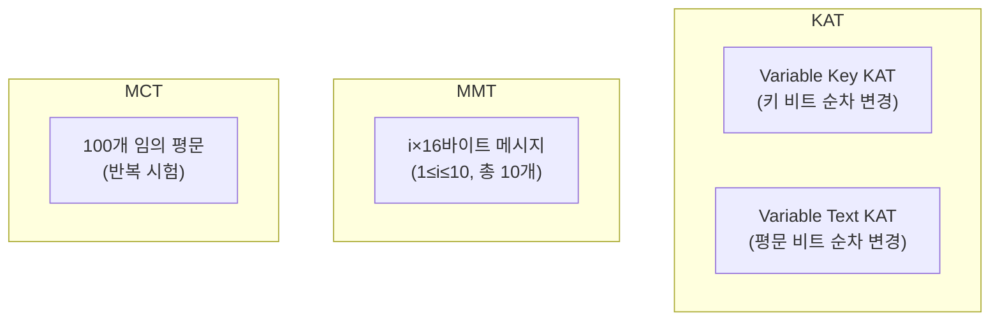

# [VER.001] KAT 파일 규격

## 1. 보안요구사항 개요
LEA 검증시스템(MOVS)에서 사용하는 시험 파일은 REQUEST(.req), RESPONSE(.rsp), FACTS(.fax) 세 종류로 구분되며, 파일명은 `LEA[키길이][운영모드명][시험유형].확장자` 형식을 따른다. KAT(Known Answer Test), MMT(Multi-block Message Test), MCT(Monte Carlo Test) 세 가지 시험 유형이 정의되어 있다.

## 2. 상세 요구사항 (Requirements)
- **LEA-048**: REQUEST 파일(.req)은 검증시스템이 제공하는 입력 데이터로, 키, IV(ECB 제외), 평문 또는 암호문을 포함해야 한다. 파일명은 `LEA[키길이][모드명]KAT.req`, `MMT.req`, `MCT.req` 형식을 따른다.
- **LEA-049**: RESPONSE 파일(.rsp)은 구현체가 REQUEST를 처리하여 생성한 결과로, `.rsp` 확장자를 사용한다.
- **LEA-050**: FACTS 파일(.fax)은 검증시스템이 보유한 정답 파일로, RESPONSE와 비교하여 PASS/FAIL을 판정한다. `.fax` 확장자를 사용한다.

### 2.1. 시험 유형별 규격

| 시험 유형 | 약어 | 내용 |
| :--- | :--- | :--- |
| Known Answer Test | KAT | Variable Key KAT + Variable Text KAT |
| Multi-block Message Test | MMT | i×블록크기(1≤i≤10)인 10개의 메시지 시험 |
| Monte Carlo Test | MCT | 100개의 임의 평문에 대한 반복 시험 |

### 2.2. 파일명 형식

| 파일 유형 | 형식 | 예시 |
| :--- | :--- | :--- |
| REQUEST | `LEA{키길이}{모드}{시험}.req` | `LEA128CBCKAT.req` |
| RESPONSE | `LEA{키길이}{모드}{시험}.rsp` | `LEA128CBCKAT.rsp` |
| FACTS | `LEA{키길이}{모드}{시험}.fax` | `LEA128CBCKAT.fax` |

### 2.3. KAT 세부 구성

| KAT 종류 | 설명 |
| :--- | :--- |
| Variable Key KAT | 고정 평문, 키 비트를 순차적으로 변경 |
| Variable Text KAT | 고정 키, 평문 비트를 순차적으로 변경 |

## 3. 작성 예시 (Examples)
### 3.1. REQUEST 파일 형식 예시 (KAT)

```
[LEA128(CBC)KAT]

COUNT = 0
KEY = 00000000000000000000000000000000
IV = 00000000000000000000000000000000
PLAINTEXT = 00000000000000000000000000000000

COUNT = 1
KEY = 80000000000000000000000000000000
IV = 00000000000000000000000000000000
PLAINTEXT = 00000000000000000000000000000000
```

### 3.2. RESPONSE 파일 형식 예시

```
[LEA128(CBC)KAT]

COUNT = 0
KEY = 00000000000000000000000000000000
IV = 00000000000000000000000000000000
PLAINTEXT = 00000000000000000000000000000000
CIPHERTEXT = a7e4e756d41a4e4a81c0816d4f95cfea

COUNT = 1
KEY = 80000000000000000000000000000000
IV = 00000000000000000000000000000000
PLAINTEXT = 00000000000000000000000000000000
CIPHERTEXT = 354e6f8f5c8e0f7d4a1b3c2d5e6f7a8b
```

### 3.3. MMT 파일 형식 예시

```
[LEA128(CBC)MMT]

COUNT = 0
KEY = 0123456789abcdef0123456789abcdef
IV = fedcba9876543210fedcba9876543210
PLAINTEXT = a0a1a2a3a4a5a6a7a8a9aaabacadaeaf

COUNT = 1
KEY = 0123456789abcdef0123456789abcdef
IV = fedcba9876543210fedcba9876543210
PLAINTEXT = a0a1a2a3a4a5a6a7a8a9aaabacadaeafb0b1b2b3b4b5b6b7b8b9babbbcbdbebf
```

### 3.4. 서술형 예시
"본 구현은 LEA 검증시스템(MOVS)의 REQUEST 파일(.req)을 입력받아 각 시험 케이스를 처리하고, 결과를 RESPONSE 파일(.rsp)로 출력한다. 파일명은 `LEA128CBCKAT.req` 형식을 따르며, KAT, MMT, MCT 세 가지 시험 유형을 모두 지원한다."

## 4. 구조도 및 시각 자료 (Visuals)
### 4.1. 검증 파일 흐름 (Mermaid)



### 4.2. 시험 유형별 메시지 구조



### 4.3. 구조 설명
- REQUEST 파일은 검증시스템이 자동 생성하며, 구현체는 이를 파싱하여 암호화/복호화를 수행한다.
- RESPONSE 파일은 구현체가 생성하며, FACTS 파일과 바이트 단위로 비교되어 판정된다.

## 5. 해설 및 증빙 가이드 (Guide)
- **파일명 정확성**: 파일명의 키 길이, 모드명, 시험 유형이 정확히 일치해야 한다. 오탈자나 대소문자 오류로 인해 검증시스템이 파일을 인식하지 못할 수 있다.
- **KAT의 의의**: Variable Key KAT는 키의 각 비트가 암호화 결과에 미치는 영향(Avalanche Effect)을 검증하고, Variable Text KAT는 평문의 각 비트가 암호문에 미치는 영향을 검증한다.
- **MMT 블록 크기**: LEA의 블록 크기는 16바이트이므로 MMT에서 i번째 메시지의 길이는 i×16바이트이다.
- **MCT 반복 구조**: MCT는 100개의 임의 평문 각각에 대해 1000회 반복 암호화를 수행하는 방식이다.
- **증빙 시 주안점**: 구현체가 REQUEST 파일을 올바르게 파싱하는지, RESPONSE 파일의 형식이 규격과 일치하는지, 모든 시험 유형(KAT, MMT, MCT)을 지원하는지 확인한다.
- **참고 규격**: LEA 검증시스템 §6.2, §6.3.
