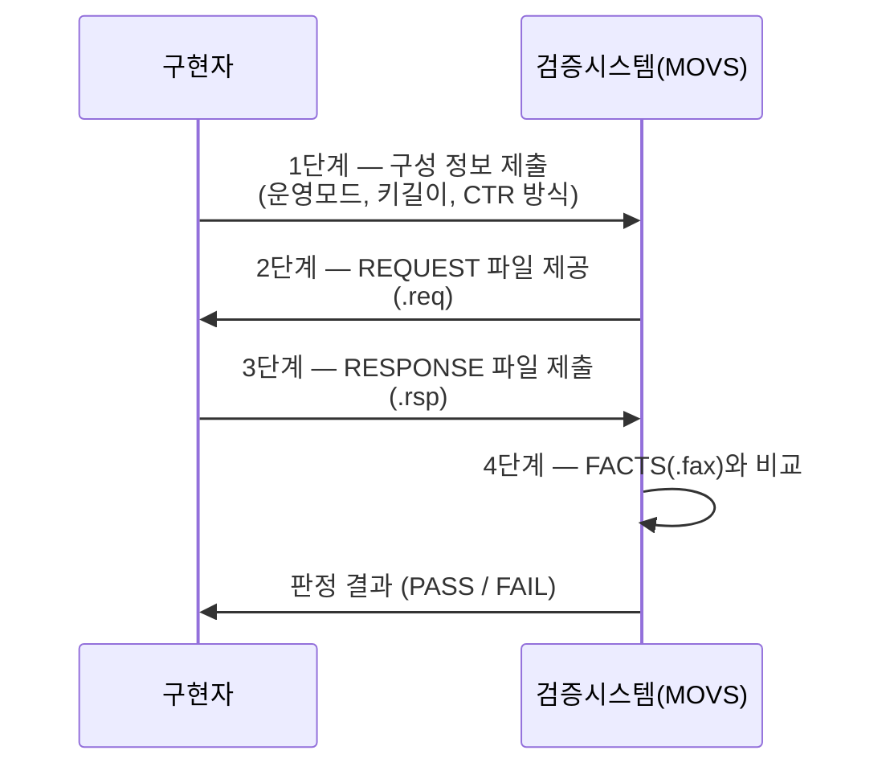
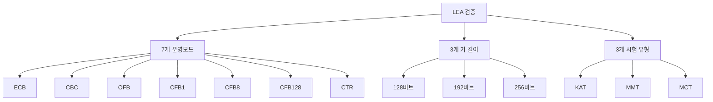

# [VER.002] 검증 절차 개요

## 1. 보안요구사항 개요
LEA MOVS(Module Output Verification System) 검증은 ECB, CBC, OFB, CFB1, CFB8, CFB128, CTR 등 7개 운영모드에 대해 128/192/256비트 키 길이별로 수행된다. 검증 과정은 구성 정보 제공 → REQUEST 수신 → RESPONSE 생성 → PASS/FAIL 판정의 4단계로 진행된다.

## 2. 상세 요구사항 (Requirements)
- **LEA-053**: LEA 구현체는 MOVS 검증 대상 운영모드를 모두 지원해야 하며, 검증 절차의 각 단계를 올바르게 수행해야 한다.

### 2.1. 검증 대상 운영모드

| 운영모드 | 설명 |
| :--- | :--- |
| ECB | Electronic Codebook Mode |
| CBC | Cipher Block Chaining Mode |
| OFB | Output Feedback Mode |
| CFB1 | Cipher Feedback Mode (1비트) |
| CFB8 | Cipher Feedback Mode (8비트) |
| CFB128 | Cipher Feedback Mode (128비트) |
| CTR | Counter Mode |

### 2.2. 키 길이별 검증

| 키 길이 (비트) | 키 길이 (바이트) | 라운드 수 |
| :--- | :--- | :--- |
| 128 | 16 | 24 |
| 192 | 24 | 28 |
| 256 | 32 | 32 |

### 2.3. 검증 절차 4단계

| 단계 | 주체 | 내용 |
| :--- | :--- | :--- |
| 1단계 | 구현자 | 구성 정보 제공 (지원 운영모드, 키 길이, CTR 카운터 초기값 생성방식) |
| 2단계 | MOVS | REQUEST 파일(.req) 제공 |
| 3단계 | 구현자 | RESPONSE 파일(.rsp) 생성 |
| 4단계 | MOVS | FACTS(.fax)와 RESPONSE 비교 → PASS/FAIL 판정 |

## 3. 작성 예시 (Examples)
### 3.1. 구성 정보 제출 양식

| 항목 | 내용 |
| :--- | :--- |
| 알고리즘명 | LEA |
| 지원 운영모드 | ECB, CBC, OFB, CFB1, CFB8, CFB128, CTR |
| 지원 키 길이 | 128, 192, 256비트 |
| CTR 카운터 초기값 | 전체 블록을 IV로 사용 |
| CTR 증가 방식 | 하위 32비트 또는 하위 64비트 카운터 증가 |

### 3.2. 검증 수행 절차 코드 (C 의사코드)

```c
/* RESPONSE 파일 생성 로직 */
int generate_response(const char *req_file, const char *rsp_file) {
    FILE *fin = fopen(req_file, "r");
    FILE *fout = fopen(rsp_file, "w");
    test_case_t tc;

    while (parse_test_case(fin, &tc) == 0) {
        LEA_KEY key;
        lea_set_key(&key, tc.key, tc.key_len);

        if (tc.type == ENCRYPT) {
            lea_cbc_enc(tc.ct, tc.pt, tc.pt_len, tc.iv, &key);
            write_response(fout, &tc);
        } else {
            lea_cbc_dec(tc.pt, tc.ct, tc.ct_len, tc.iv, &key);
            write_response(fout, &tc);
        }

        memset_s(&key, sizeof(key), 0, sizeof(key));
    }

    fclose(fin);
    fclose(fout);
    return 0;
}
```

### 3.3. 모드별 검증 매트릭스

| 운영모드 | 128비트 | 192비트 | 256비트 | KAT | MMT | MCT |
| :--- | :--- | :--- | :--- | :--- | :--- | :--- |
| ECB | O | O | O | O | O | O |
| CBC | O | O | O | O | O | O |
| OFB | O | O | O | O | O | O |
| CFB1 | O | O | O | O | O | O |
| CFB8 | O | O | O | O | O | O |
| CFB128 | O | O | O | O | O | O |
| CTR | O | O | O | O | O | O |

### 3.4. 서술형 예시
"본 구현은 LEA MOVS 검증을 위해 ECB, CBC, OFB, CFB1, CFB8, CFB128, CTR 7개 운영모드를 128/192/256비트 키 길이에 대해 모두 지원한다. 검증시스템으로부터 REQUEST 파일을 수신하여 RESPONSE 파일을 생성하며, MOVS가 FACTS와 비교하여 PASS/FAIL을 판정한다."

## 4. 구조도 및 시각 자료 (Visuals)
### 4.1. 검증 절차 흐름도 (Mermaid)



### 4.2. 검증 범위 구조



### 4.3. 구조 설명
- 전체 검증 범위는 7개 모드 × 3개 키 길이 × 3개 시험 유형 = 63개 시험 조합이다.
- 각 조합에 대해 REQUEST/RESPONSE/FACTS 파일이 별도로 생성·관리된다.

## 5. 해설 및 증빙 가이드 (Guide)
- **전체 모드 지원 필수**: 검증 신청 시 지원한다고 명시한 운영모드는 모두 PASS를 받아야 한다. 하나의 모드라도 FAIL이면 검증이 불합격된다.
- **CTR 카운터 명시**: CTR 모드의 카운터 초기값 생성방식(전체 블록 IV, 하위 32비트 카운터 등)을 구성 정보에 정확히 기재해야 한다. MOVS는 이 정보를 기반으로 REQUEST를 생성한다.
- **CFB 모드 주의**: CFB1, CFB8은 비트/바이트 단위 피드백이므로 블록 단위(CFB128)와 처리 방식이 상이하다. 각각의 구현이 별도로 필요하다.
- **증빙 시 주안점**: 구현체가 7개 운영모드 × 3개 키 길이를 모두 지원하는지, REQUEST 파싱 및 RESPONSE 생성 로직이 올바른지, 생성된 RESPONSE가 FACTS와 일치하는지 확인한다.
- **참고 규격**: LEA 검증시스템 제6장.
