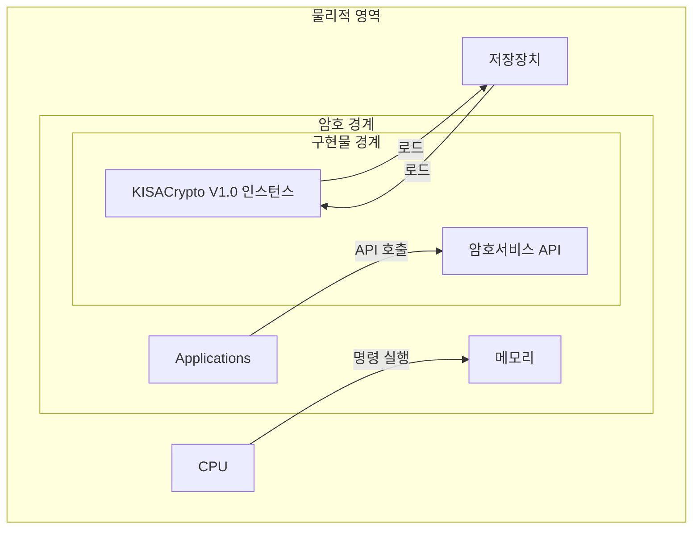

# [AS02.07] 암호경계 및 경계 내의 구성 요소 명세

## 1. 보안요구사항 개요
암호모듈의 물리적 영역, 암호 경계, 구현물 경계를 명확히 정의하고, 각 경계 내에 포함되는 구성 요소를 상세히 명세해야 함.

## 2. 상세 요구사항 (Requirements)
- **VE02.07.01**: 암호경계 안의 모든 구성요소들을 명세한 개발문서 제출

## 3. 작성 예시 (Examples)

### 3.1. 표 형식 예시 (암호모듈 구성요소)
| 구분 | 구성요소 | 구성 형태 | 비고 |
| :--- | :--- | :--- | :--- |
| **SW** | 암호모듈 | KISACrypto32.dll | 윈도우용 라이브러리 32비트 |
| **SW** | 암호모듈 | KISACrypto64.dll | 윈도우용 라이브러리 64비트 |
| **SW** | 암호모듈 | libKISACrypto64.so | 리눅스용 라이브러리 64비트 |

### 3.2. 서술형 예시
"본 암호모듈은 소프트웨어 형태로 구현되었으며, KISACrypto V1.0 인스턴스를 핵심 구현물 경계로 설정한다. 암호 경계는 해당 인스턴스와 이를 호출하는 애플리케이션 및 메모리 영역을 포함한다."

## 4. 구조도 및 시각 자료 (Visuals)

### 4.1. 암호모듈 경계 논리 구조 (Mermaid)

### 4.2. 구조도 상세 설명
- **물리적 영역**: CPU, 저장장치 등 암호모듈이 동작하는 하드웨어 전체 범위.
- **암호 경계**: 보안 요구사항이 적용되는 논리적 범위로 애플리케이션 및 구현물 경계를 포함.
- **구현물 경계**: 벤더가 직접 개발한 핵심 암호 서비스 API 영역.

## 5. 해설 및 증빙 가이드 (Guide)
- **계층 구조 준수**: "구현물 경계 ⊂ 암호 경계 ⊂ 물리적 영역"의 계층 구조가 도면에 명확히 나타나야 함.
- **인터페이스 정의**: 구현물 경계를 기준으로 하되, 필요시 암호 경계까지 확장하여 명세할 수 있음.