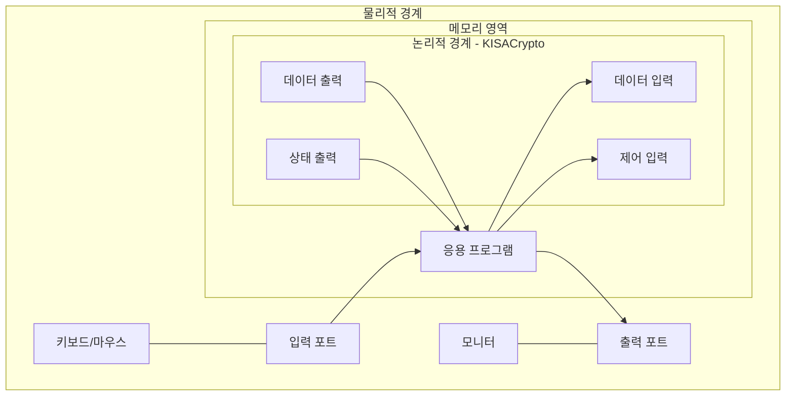

# [AS03.01/02] 물리적 포트 및 논리적 인터페이스 명세

## 1. 보안요구사항 개요
암호모듈의 물리적 접근 지점(포트)과 정보를 주고받는 논리적 통로(인터페이스)를 명확히 구분하여 정의하고, 각 논리적 인터페이스가 어떤 물리적 포트를 통해 데이터가 흐르는지 그 연관 관계를 명세해야 함.

## 2. 상세 요구사항 (Requirements)
- **VE03.01.01~03**: 물리적 포트와 논리적 인터페이스의 명세 및 정보 흐름의 접근 지점 명시
- **VE03.02.01~02**: 논리적 인터페이스의 구분(입력, 출력, 제어, 상태) 및 물리적 포트와의 연관관계 명세

## 3. 작성 예시 (Examples)

### 3.1. 논리적 인터페이스 구성 개요
"KISACrypto V1.0의 논리적 인터페이스는 제어 입력, 데이터 입력, 데이터 출력, 상태 출력 인터페이스로 구성된다. 소프트웨어 암호모듈 특성상 물리적 포트와 직접 만나지 않으며, 응용 프로그램을 통해 물리적 포트(키보드, 모니터 등)와 간접적으로 연결된다."

### 3.2. [표] 논리적 인터페이스 및 물리적 포트 접점 상세 설명
| 인터페이스 | 논리적 인터페이스 설명 | 물리적 포트 |
| :--- | :--- | :--- |
| **데이터 입력** | 라이브러리 API 호출 시 모듈로 전달되는 데이터 및 파라미터 | 네트워크 포트, 키보드, 시리얼, USB |
| **데이터 출력** | API 호출 결과로 반환되는 값 및 출력 파라미터 | 관리자 PC의 모니터 |
| **제어 입력** | 모듈 시작/종료, 운영 제어를 위해 전달되는 값 (API 함수 호출 입력) | 네트워크 포트, 키보드, 시리얼, USB |
| **상태 출력** | API 호출 시 반환되는 상태 정보(성공/오류 코드) | 관리자 PC의 모니터 |

## 4. 구조도 및 시각 자료 (Visuals)

### 4.1. 인터페이스 및 포트 매핑 구조 (Mermaid)

### 4.2. 구조도 상세 설명
- **논리적 분리**: 제어 입력과 데이터 입력은 동일한 물리적 포트를 사용하더라도 API 함수 호출의 형태(파라미터 구분)로 논리적으로 명백히 분리됨.
- **간접 연결**: 본 모듈은 S/W 라이브러리이므로 물리적 포트와 직접 접촉하지 않고 응용 프로그램의 I/O 프로세스를 통해 정보를 교환함.

## 5. 해설 및 증빙 가이드 (Guide)
- **연관관계 명시**: 각 논리적 인터페이스가 실제 하드웨어의 어떤 포트(USB, 네트워크 등)를 거쳐 들어오는지 표와 다이어그램으로 증명해야 함.
- **분리 근거 제시**: 동일한 물리적 포트를 여러 인터페이스가 공유할 경우(예: 키보드로 제어문자와 데이터를 모두 입력), 이를 소프트웨어적으로 어떻게 분리하여 처리하는지(함수 인자 구분 등) 기술적 근거가 필요함.
- **입출력 포트 전수 조사**: 모듈이 동작하는 환경에서 사용 가능한 모든 물리적 입출력 경로를 검토하여 누락 없이 기재할 것.