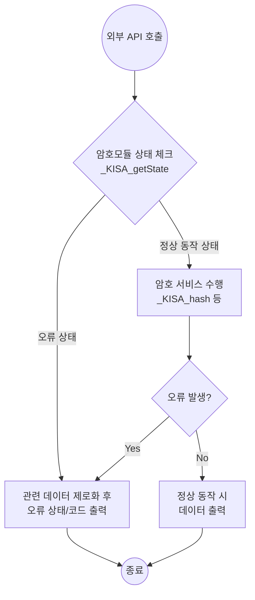

# [AS03.07] 특정 상태에서의 데이터 출력 금지

## 1. 보안요구사항 개요
암호모듈이 자가시험, 오류 상태, 제로화, 수동 키 주입 등 보안상 민감한 상태에 있을 때, 인가되지 않은 데이터가 외부 인터페이스를 통해 출력되지 않도록 보장하는 메커니즘을 명세해야 함.

## 2. 상세 요구사항 (Requirements)
- **VE03.07.01**: 데이터 출력 금지 방법 명세
- **VE03.07.02**: 데이터 출력 금지를 보장하는 방법에 대한 명세

## 3. 작성 예시 (Examples)

### 3.1. [표] 상태별 데이터 출력 금지 메커니즘
| 관련 상태 | 데이터 출력 금지 메커니즘 |
| :--- | :--- |
| **자가시험** | - `KCMVP_Crypto_selftest()`는 데이터 출력 파라미터가 존재하지 않음. - 내부적으로 데이터 입출력 함수를 사용하지 않으며, 성공/실패 여부만 상태 코드로 반환함. |
| **암호서비스** | - 서비스 API 수행 전, 내부 함수(`_KISA_getState()`)를 통해 모듈 상태를 선제적으로 체크함. - 오류 상태인 경우 서비스를 수행하지 않고 즉각 종료함. - 수행 중 오류 발생 시, 내부 데이터를 즉시 제로화한 후 오류 코드만 반환함. |
| **제로화** | - 명시적인 제로화 상태를 유지하는 동안에는 모든 서비스 호출이 차단됨. - 제로화 API가 동작하는 과정에서는 데이터 출력 인터페이스가 활성화되지 않음. |

### 3.2. 서술형 예시
"본 암호모듈은 모든 외부분기 API 진입 시 `_KISA_getState()`를 호출하여 현재 상태를 확인한다. 정상 동작 상태(Normal State)가 아닌 경우 데이터 연산 자체를 거부하며, 연산 중 예외가 발생할 경우 생성 중이던 임시 데이터를 모두 제로화한 후 제어권을 반환함으로써 데이터 유출을 원천 차단한다."

## 4. 구조도 및 시각 자료 (Visuals)

### 4.1. 데이터 출력 차단 로직 (Mermaid)

### 4.2. 구조도 상세 설명
- **선검사(Pre-check)**: API 호출 직후 상태 체크를 수행하여 비정상 상태에서의 진입을 차단함.
- **예외 처리 시 제로화**: 연산 중 오류가 발생하더라도 잔류 데이터가 남지 않도록 제로화 프로세스를 거친 후 상태 코드만 반환함.

## 5. 해설 및 증빙 가이드 (Guide)
- **상태 정의**: 오류 상태, 자가시험 상태, 제로화 상태 등 데이터 출력이 금지되어야 하는 상태를 명확히 정의해야 함.
- **보장 방법**: 단순한 정책 설명이 아니라, 실제 소스코드에서 어떤 함수(`getState` 등)를 통해 이를 강제하고 있는지 논리적 근거를 제시해야 함.
- **제로화 연동**: 특히 오류 발생 시 내부 데이터를 지우는 '사후 제로화' 메커니즘이 포함되어 있는지 심사 시 확인하므로 이를 설계서에 누락 없이 기재할 것.