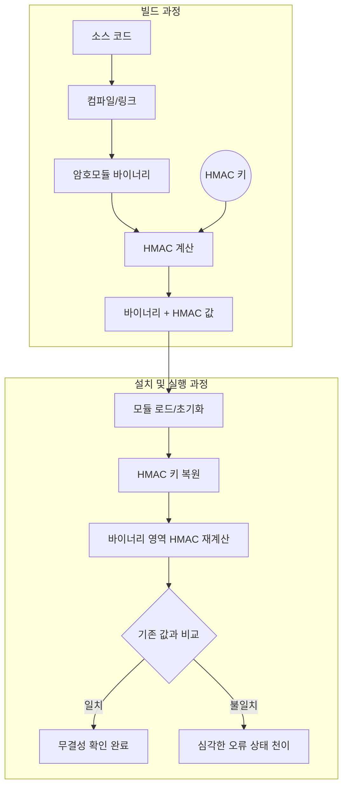

# [AS05.02] 무결성 기법과 시험방법에 대한 명세

## 1. 보안요구사항 개요
암호모듈의 변조 여부를 확인하기 위해 적용된 소프트웨어 무결성 기법(HMAC, 전자서명 등)을 명세하고, 빌드 시 검증값 생성 절차와 실행 시 무결성 시험을 수행하는 구체적인 방법을 상세히 기술해야 함.

## 2. 상세 요구사항 (Requirements)
- **VE05.02.01**: 사용된 검증대상 무결성 기법과 운영자가 무결성 시험을 수행하는 방법 명세

## 3. 작성 예시 (Examples)

### 3.1. 무결성 기법 적용 및 검증값 생성 (빌드 과정)
"KISACrypto V1.0 암호모듈은 소프트웨어 무결성 시험을 위해 HMAC-SHA256 알고리즘을 적용한다. 무결성 검증값을 생성 및 연접하는 빌드 절차는 다음과 같다."
1. 암호모듈을 빌드한 후 생성된 바이너리 파일(.dll 또는 .so)에 대해 HMAC-SHA256 알고리즘을 적용하여 무결성 검증값을 계산함.
2. 생성된 무결성 검증값은 바이너리 파일의 맨 뒤쪽(End of File)에 연접함.
3. 검증값 생성 시 사용되는 HMAC 키는 소스코드 내에 분산된 형태로 하드코딩되어 저장되며, 이는 무결성 검증 시 복원되어 사용됨.

### 3.2. 무결성 시험 절차 (설치 및 실행 과정)
"암호모듈 초기화 시 수행되는 동작 전 자가시험 과정에서 다음과 같은 절차로 무결성 시험을 수행한다."
1. **HMAC 키 복원**: 소스코드에 분산 저장되어 있는 HMAC 키 조각들을 메모리 상에 하나로 복원함.
2. **바이너리 경로 획득**: 운영체제 API(Windows의 `GetModuleFileName` 등)를 통해 현재 로드된 암호모듈 바이너리의 물리적 경로를 얻어냄.
3. **무결성 값 재계산**: 획득한 경로의 바이너리 파일에서, 파일 끝에 연접된 기존 검증값을 제외한 나머지 전체 영역에 대해 HMAC-SHA256을 적용하여 새로운 검증값을 계산함.
4. **결과 비교**: 새로 계산된 값과 바이너리에 연접되어 있던 기존 검증값을 비교하여, 일치할 경우 무결성 시험을 통과한 것으로 간주함.

## 4. 구조도 및 시각 자료 (Visuals)

### 4.1. 무결성 검증 프로세스 (Mermaid)

## 5. 해설 및 증빙 가이드 (Guide)
- **KAT 간소화 규정**: GVI Part I 10.2 지침에 따라, 소프트웨어 무결성 시험 자체가 암호모듈 자기 자신을 입력값으로 하고 저장된 검증값을 Known Answer로 사용하는 **KAT(Known Answer Test)**로 간주됨. 따라서 무결성 시험 이전에 해당 알고리즘(HMAC 등)에 대한 별도의 KAT를 반드시 선행할 필요는 없음.
- **분산 저장의 목적**: 무결성 검증용 키를 하드코딩할 때 소스코드 여러 곳에 분산하여 저장함으로써, 단순한 문자열 검색(String search)을 통한 키 유출 가능성을 낮추는 설계 근거를 제시할 것.
- **파일 경로 처리**: 런타임에 바이너리 파일을 직접 읽어 무결성을 검증하는 경우, 실제 파일 시스템 상의 경로를 정확히 획득하는 로직이 상세설계서에 포함되어야 함.