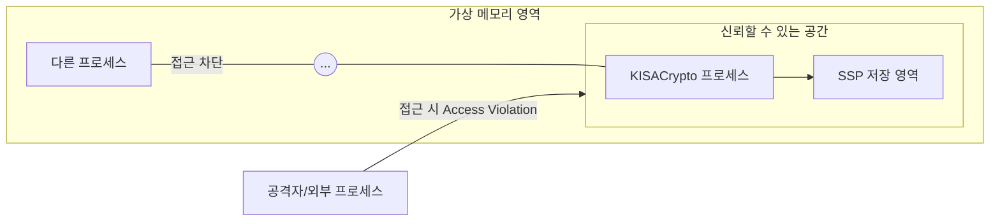

# [AS06.05] 암호모듈의 독립적인 SSP 제어 수행 명세

## 1. 보안요구사항 개요
암호모듈 인스턴스가 자신의 중요보안매개변수(SSP)를 스스로 제어하고, 운영체제의 보호 메커니즘을 통해 다른 프로세스로부터의 간섭이나 비인가된 접근을 차단하고 있음을 명세해야 함.

## 2. 상세 요구사항 (Requirements)
- **VE06.05.01**: 암호모듈 인스턴스가 스스로의 SSP를 제어하는 운영체제 메커니즘 명세

## 3. 작성 예시 (Examples)

### 3.1. 운영환경별 보안 메커니즘 적용 현황
"KISACrypto V1.0은 윈도우와 리눅스 운영체제의 가상 메모리 분리 및 프로세스 보안 기법을 활용하여 독립적인 SSP 제어를 보장한다."

| 보안 메커니즘 | 상세 내용 |
| :--- | :--- |
| **단일 운영자 메커니즘** | - 한 번에 한 명의 운영자만 모듈을 사용하도록 제한. - 운영체제는 프로세스를 가상 메모리 영역 상에서 분리하여 타 프로세스와의 통신을 원천 차단함. |
| **접근 방지 메커니즘** | - 암호모듈은 호출 프로그램 내에서 독립적으로 실행됨. - 모듈이 생성한 프로세스/메모리는 해당 인스턴스에 의해서만 소유 및 접근 가능함. |
| **간섭 방지 메커니즘** | - 할당된 주소 영역 외의 접근 시 `Access Violation` 오류를 발생시켜 타 프로세스의 침범을 방지함. |

### 3.2. 운영체제 상세 보호 기술 (OS-Specific)
1. **Windows 환경**: GS(Stack Buffer Overrun Detection), SEH, ASLR, DEP 기술을 적용하여 메모리 오염 및 임의 코드 실행을 방지함.
2. **Linux 환경**: ASLR, DEP, ASCII-Armor, Stack Canary, RELRO, PIE 기술을 통해 SSP 저장 영역의 주소를 난수화하고 실행 권한을 통제함.

## 4. 구조도 및 시각 자료 (Visuals)

### 4.1. 프로세스 간 메모리 격리 구조 (Mermaid)

## 5. 해설 및 증빙 가이드 (Guide)
- **메모리 보호 기법의 명시**: 소프트웨어 암호모듈의 경우, 위 예시와 같이 OS 자체 보안 기능(ASLR, DEP 등)을 적극적으로 언급하여 SSP 보호 능력을 증빙하는 것이 표준임.
- **인스턴스 독립성**: 동일한 시스템에서 여러 개의 응용 프로그램이 암호모듈을 로드하더라도, OS의 프로세스 격리 기능을 통해 각 인스턴스의 SSP가 섞이지 않음을 강조해야 함.
- **설계서 매핑**: 본 항목에서 언급한 보안 기법들이 실제 빌드 옵션(예: `/GS` 옵션 등)으로 적용되었는지 확인하여 일관성을 유지할 것.