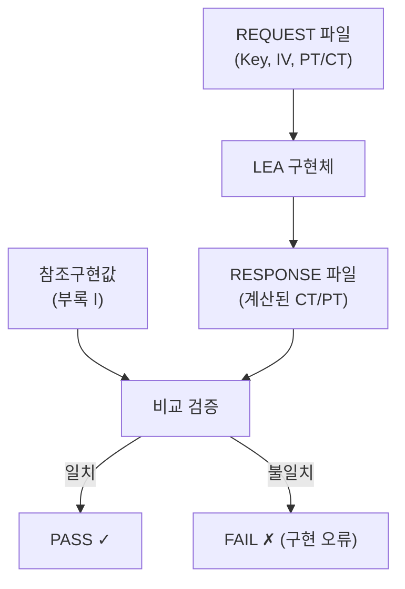
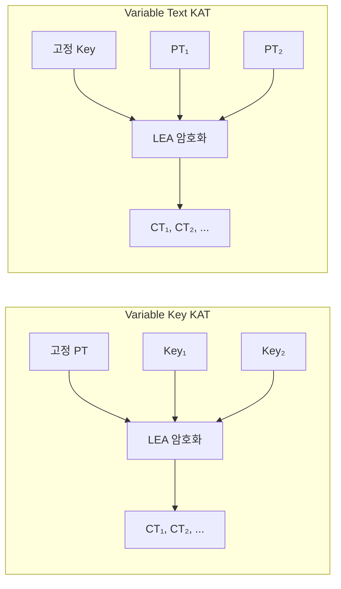

# [LEA.020] KAT 벡터 규격

## 1. 보안요구사항 개요
KAT(Known Answer Test, 기지 답안 검사)는 LEA 구현의 정확성을 검증하기 위해 사전에 정의된 입력-출력 벡터를 대조하는 시험으로, REQUEST 파일에 키·IV·평문/암호문을 명시하고 RESPONSE 파일에 출력값을 기재하며, Variable Key KAT와 Variable Text KAT를 모두 수행해야 한다.

## 2. 상세 요구사항 (Requirements)
- **LEA-048**: KAT REQUEST 파일은 `LEA[키길이][운영모드명]KAT.req` 형식의 파일명을 따르며, 키(Key), IV(ECB 모드 제외), 평문(PT) 또는 암호문(CT)을 포함해야 한다.
- **LEA-KAT-VARIABLE-KEY**: Variable Key KAT를 수행한다.
- **LEA-KAT-VARIABLE-TEXT**: Variable Text KAT를 수행한다.
- **LEA-KAT-RESPONSE-CONTENT**: RESPONSE 파일에 REQUEST 입력값과 계산된 출력값을 기재한다.
- **LEA-KAT-REFERENCE-MATCH**: KAT 결과를 규정된 참조값과 대조한다.

`LEA-051` 및 `LEA-052`는 활성 규칙 식별자와 충돌하던 기존 파생 문서의 표기이므로 사용하지 않는다.

## 3. 작성 예시 (Examples)
### 3.1. 참조구현값 (LEA 표준 규격서 부록 Ⅰ)

| 키 길이 | Key (hex) | Plaintext (hex) | Ciphertext (hex) |
| :--- | :--- | :--- | :--- |
| LEA-128 | `0f1e2d3c4b5a69788796a5b4c3d2e1f0` | `101112131415161718191a1b1c1d1e1f` | `9fc84e3528c6c6185532c7a704648bfd` |
| LEA-192 | `0f1e2d3c4b5a69788796a5b4c3d2e1f0` `f0e1d2c3b4a59687` | `202122232425262728292a2b2c2d2e2f` | `6fb95e325aad1b878cdcf5357674c6f2` |
| LEA-256 | `0f1e2d3c4b5a69788796a5b4c3d2e1f0` `f0e1d2c3b4a5968778695a4b3c2d1e0f` | `303132333435363738393a3b3c3d3e3f` | `d651aff647b189c13a8900ca27f9e197` |

### 3.2. REQUEST 파일 형식 예시

```
# LEA128ECBKAT.req
# LEA-128 ECB Known Answer Test - Variable Key

[ENCRYPT]

COUNT = 0
KEY = 0f1e2d3c4b5a69788796a5b4c3d2e1f0
PLAINTEXT = 101112131415161718191a1b1c1d1e1f

COUNT = 1
KEY = 1f0e2d3c4b5a69788796a5b4c3d2e1f0
PLAINTEXT = 101112131415161718191a1b1c1d1e1f
```

### 3.3. RESPONSE 파일 형식 예시

```
# LEA128ECBKAT.rsp
# LEA-128 ECB Known Answer Test - Variable Key

[ENCRYPT]

COUNT = 0
KEY = 0f1e2d3c4b5a69788796a5b4c3d2e1f0
PLAINTEXT = 101112131415161718191a1b1c1d1e1f
CIPHERTEXT = 9fc84e3528c6c6185532c7a704648bfd

COUNT = 1
KEY = 1f0e2d3c4b5a69788796a5b4c3d2e1f0
PLAINTEXT = 101112131415161718191a1b1c1d1e1f
CIPHERTEXT = ...
```

### 3.4. 파일명 규칙 표

| 키 길이 | 운영모드 | REQUEST 파일명 | RESPONSE 파일명 |
| :--- | :--- | :--- | :--- |
| 128 | ECB | LEA128ECBKAT.req | LEA128ECBKAT.rsp |
| 128 | CBC | LEA128CBCKAT.req | LEA128CBCKAT.rsp |
| 192 | ECB | LEA192ECBKAT.req | LEA192ECBKAT.rsp |
| 192 | CTR | LEA192CTRKAT.req | LEA192CTRKAT.rsp |
| 256 | ECB | LEA256ECBKAT.req | LEA256ECBKAT.rsp |

## 4. 구조도 및 시각 자료 (Visuals)
### 4.1. KAT 검증 흐름 (Mermaid)



### 4.2. Variable Key / Variable Text 구분



## 5. 해설 및 증빙 가이드 (Guide)
- **참조구현값 대조 필수**: LEA-128, LEA-192, LEA-256 각각의 참조구현값(부록 Ⅰ)과 구현 결과를 1바이트 단위로 대조해야 한다. 엔디언 처리 오류가 가장 흔한 불일치 원인이다.
- **Variable Key + Variable Text 모두 수행**: 한쪽만 수행하면 검증이 불완전하다. Key를 변화시킨 검사와 Text를 변화시킨 검사를 모두 수행하여 구현의 완전성을 보장한다.
- **ECB 모드에서 IV 생략**: ECB 모드는 초기화 벡터(IV)를 사용하지 않으므로 REQUEST 파일에 IV 필드가 없다. CBC, CTR 등 다른 모드에서는 IV를 반드시 포함한다.
- **파일명 규칙 준수**: 검증 시스템이 파일명을 파싱하여 자동 검증하므로, `LEA[키길이][모드명]KAT.req/rsp` 형식을 정확히 따라야 한다.
- **참고 규격**: LEA 검증시스템 §6.2, LEA 표준 규격서 부록 Ⅰ.
