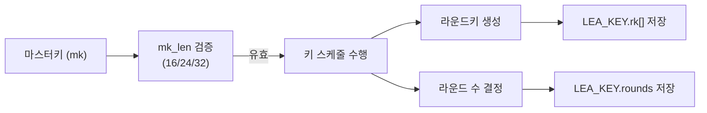

# [API.001] 참조 배포본의 핵심 API 프로파일

> 본 문서는 LEA 단독 C 배포 소스의 인터페이스를 설명한다. 해당 함수명과 타입명은 코드 역할을 파악하는 근거로 활용하되, 독자 구현의 KCMVP 위반을 확정하는 보편적 명명 요구사항으로 해석하지 않는다.

## 1. 보안요구사항 개요
LEA 단독 C 배포 소스는 `lea_set_key`를 통해 `LEA_KEY` 구조체에 라운드키와 키 길이 정보를 설정한다. 매뉴얼은 `mk_len`의 입력값으로 16, 24, 32바이트를 명시하며, `lea_set_key`의 반환형은 `void`로 제시한다.

## 2. 상세 요구사항 (Requirements)
- **LEA-REF-API-001**: 참조 배포본은 `lea_set_key(LEA_KEY *key, const unsigned char *mk, unsigned int mk_len)`를 제공한다.
- **LEA-REF-API-002**: 참조 배포본의 `LEA_KEY`는 라운드키와 키 길이 정보를 포함한다.

## 3. 작성 예시 (Examples)
### 3.1. 함수 시그니처

```c
/**
 * @brief LEA 마스터키로부터 라운드키를 생성하여 LEA_KEY에 저장
 * @param key    라운드키가 저장될 LEA_KEY 구조체 포인터
 * @param mk     마스터키 바이트 배열
 * @param mk_len 마스터키 길이 (16, 24, 32)
 */
void lea_set_key(LEA_KEY *key, const unsigned char *mk, unsigned int mk_len);
```

### 3.2. LEA_KEY 구조체 정의 예시

```c
typedef struct {
    unsigned int rk[192];  /* 라운드키 배열 (최대 32라운드 × 6워드) */
    unsigned int rounds;   /* 라운드 수: 24(128비트), 28(192비트), 32(256비트) */
} LEA_KEY;
```

### 3.3. 키 설정 호출 예시

```c
LEA_KEY key;
unsigned char mk[32] = { /* 외부에서 주입된 256비트 마스터키 */ };

lea_set_key(&key, mk, 32);
```

### 3.4. 키 길이별 라운드 수

| 마스터키 길이 (바이트) | 마스터키 길이 (비트) | 라운드 수 (Nr) |
| :--- | :--- | :--- |
| 16 | 128 | 24 |
| 24 | 192 | 28 |
| 32 | 256 | 32 |

### 3.5. 서술형 예시
"참조 배포본은 `lea_set_key`를 통해 마스터키로부터 라운드키를 생성하여 `LEA_KEY`에 저장한다. 해당 배포 API의 반환형은 `void`이다."

## 4. 구조도 및 시각 자료 (Visuals)
### 4.1. 키 설정 흐름도 (Mermaid)



### 4.2. 구조 설명
- 매뉴얼의 배포 소스에서 `lea_set_key`는 운영모드 처리 전에 라운드키를 설정한다.
- `LEA_KEY` 구조체는 이후 암호화/복호화 함수에 전달되어 라운드키를 참조하는 데 사용된다.

## 5. 해설 및 증빙 가이드 (Guide)
- **입력 범위**: 참조 배포본을 점검할 경우 `mk_len`이 16, 24, 32인지 확인한다.
- **구조체 정의**: 참조 배포본을 식별한 경우 `LEA_KEY`의 라운드키와 키 길이 정보를 확인한다.
- **비추론 한계**: 함수명과 타입명이 다르다는 사실만으로 독자 구현의 위반을 확정하지 않는다.
- **참고 규격**: 블록암호 LEA 소스코드 사용 매뉴얼(v1.0) §4.3.1.
