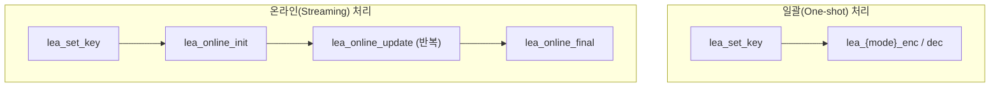

# [API.002] 참조 배포본의 모드별 API 프로파일

> 본 명칭은 사용 매뉴얼이 설명하는 배포 소스의 API이다. 독자 구현이 동일한 이름을 사용해야 한다는 보안 요구사항은 아니다.

## 1. 참조 프로파일 개요

매뉴얼이 설명하는 LEA 단독 C 배포 소스는 운영모드별 암호화·복호화 함수에 `lea_{mode}_{enc|dec}` 형태의 이름을 사용하고, 온라인 처리를 위해 `lea_online_init`, `lea_online_update`, `lea_online_final`을 제공한다. 이 명칭은 해당 배포본의 코드 역할을 식별하는 근거이며, MOVS 교환 파일이나 독자 구현의 필수 API 명명 요구사항이 아니다.

## 2. 상세 요구사항 (Requirements)
- **LEA-REF-API-003**: 참조 배포본은 아래의 모드별 함수명을 제공한다.

### 2.1. 일괄(One-shot) 처리 함수명

| 운영모드 | 암호화 함수 | 복호화 함수 |
| :--- | :--- | :--- |
| ECB | `lea_ecb_enc` | `lea_ecb_dec` |
| CBC | `lea_cbc_enc` | `lea_cbc_dec` |
| CTR | `lea_ctr_enc` | `lea_ctr_dec` |
| CFB128 | `lea_cfb128_enc` | `lea_cfb128_dec` |
| OFB | `lea_ofb_enc` | `lea_ofb_dec` |

### 2.2. 온라인(스트리밍) 처리 함수명

| 함수명 | 역할 |
| :--- | :--- |
| `lea_online_init` | 온라인 모드 컨텍스트 초기화 |
| `lea_online_update` | 데이터 청크 단위 처리 |
| `lea_online_final` | 잔여 데이터 처리 및 종료 |

## 3. 작성 예시 (Examples)
### 3.1. 일괄 처리 함수 시그니처 (C 코드)

```c
/* ECB 모드 */
void lea_ecb_enc(unsigned char *ct, const unsigned char *pt,
                 unsigned int pt_len, const LEA_KEY *key);
void lea_ecb_dec(unsigned char *pt, const unsigned char *ct,
                 unsigned int ct_len, const LEA_KEY *key);

/* CBC 모드 */
void lea_cbc_enc(unsigned char *ct, const unsigned char *pt,
                 unsigned int pt_len, const unsigned char *iv,
                 const LEA_KEY *key);
void lea_cbc_dec(unsigned char *pt, const unsigned char *ct,
                 unsigned int ct_len, const unsigned char *iv,
                 const LEA_KEY *key);

/* CTR 모드 */
void lea_ctr_enc(unsigned char *ct, const unsigned char *pt,
                 unsigned int pt_len, const unsigned char *ctr,
                 const LEA_KEY *key);
void lea_ctr_dec(unsigned char *pt, const unsigned char *ct,
                 unsigned int ct_len, const unsigned char *ctr,
                 const LEA_KEY *key);

/* CFB128 모드 */
void lea_cfb128_enc(unsigned char *ct, const unsigned char *pt,
                    unsigned int pt_len, const unsigned char *iv,
                    const LEA_KEY *key);
void lea_cfb128_dec(unsigned char *pt, const unsigned char *ct,
                    unsigned int ct_len, const unsigned char *iv,
                    const LEA_KEY *key);

/* OFB 모드 */
void lea_ofb_enc(unsigned char *ct, const unsigned char *pt,
                 unsigned int pt_len, const unsigned char *iv,
                 const LEA_KEY *key);
void lea_ofb_dec(unsigned char *pt, const unsigned char *ct,
                 unsigned int ct_len, const unsigned char *iv,
                 const LEA_KEY *key);
```

### 3.2. 온라인 처리 함수 시그니처 (C 코드)

```c
int lea_online_init(LEA_ONLINE_CTX *ctx, unsigned int encType,
                    const unsigned char *mk, int mk_len);
int lea_online_init_ex(LEA_ONLINE_CTX *ctx, unsigned int encType,
                       const LEA_KEY *key);
int lea_online_update(LEA_ONLINE_CTX *ctx, unsigned char *out,
                      const unsigned char *in, unsigned int in_len);
int lea_online_final(LEA_ONLINE_CTX *ctx, unsigned char *out);
```

### 3.3. 서술형 예시
"참조 배포본은 LEA 운영모드별 함수명으로 `lea_ecb_enc`, `lea_cbc_dec` 등을 사용하며, 온라인 처리를 위해 `lea_online_init`, `lea_online_update`, `lea_online_final`을 제공한다."

## 4. 구조도 및 시각 자료 (Visuals)
### 4.1. API 호출 패턴 비교 (Mermaid)



### 4.2. 구조 설명
- **일괄 처리**: 전체 평문/암호문이 메모리에 있을 때 한 번의 함수 호출로 처리한다.
- **온라인 처리**: 데이터를 청크 단위로 분할하여 `update`를 반복 호출하고, 마지막에 `final`로 잔여 데이터를 처리한다. 대용량 파일 암호화에 적합하다.

## 5. 해설 및 증빙 가이드 (Guide)
- **배포본 식별**: 해당 LEA 단독 C 배포본을 점검할 때에는 표의 함수명을 역할 식별과 호출 추적에 활용한다.
- **CFB 모드**: 매뉴얼은 배포본의 CFB128 인터페이스로 `lea_cfb128_enc`와 `lea_cfb128_dec`를 설명한다.
- **비추론 한계**: 독자 구현의 함수명이 다르다는 사실만으로 MOVS 연동 실패나 KCMVP 위반을 판정하지 않는다. 온라인 처리 순서는 실제 API 계약과 호출 관계로 확인한다.
- **참고 규격**: 블록암호 LEA 소스코드 사용 매뉴얼(v1.0) §4.3.2–§4.3.15.
